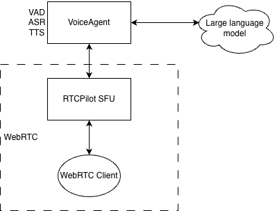

# Voice Agent - Real-time Voice Conversation AI Agent

[中文](README.md) | English


## Project Overview

**Voice Agent** is an advanced real-time voice conversation AI agent with the following core capabilities:

- 🎤 **Speaking** - Natural and fluent speech synthesis
- 👂 **Understanding** - High-precision speech recognition
- 💬 **Interactive** - Intelligent dialogue management and context understanding
- ⚡ **Real-time Response** - Low-latency voice processing and feedback
- 🔧 **Highly Customizable** - Support for multiple LLM models and configuration options

## Technical Architecture

**Voice Agent project is a real-time voice conversation AI agent based on RTCPilot (WebRTC SFU).**



Voice Agent adopts a modular design with the following main components:

- **Core Service** (`voice_agent.py`) - Main server entry point, responsible for coordinating modules
- **Session Management** - Handles user sessions and conversation state
- **Model Management** - Manages VAD, ASR (Automatic Speech Recognition) models and TTS (Text-to-Speech) models
- **WebSocket Service** - Implements real-time voice transmission and processing by integrating with RTCPilot (WebRTC SFU), RTCPilot open source: [https://github.com/runner365/RTCPilot](https://github.com/runner365/RTCPilot)
- **Worker Management** - Handles compute-intensive tasks such as voice processing
- **Configuration System** - Flexible YAML configuration management


## Supported LLM Models

- **Qwen** (Tongyi Qianwen)
- **Yuanbao** (Yuanbao)
- **OpenAI** (GPT series)
- **DeepSeek** (DeepSeek)

```
llm_config:
  llm_type: "qwen" # qwen, yuanbao, openai, deepseek
  model_name: ""  # use default model if empty, eg qwen-plus, hunyuan-turbo, gpt-3.5-turbo, deepseek-turbo

```

export LLM_API_KEY=your_api_key

Add the LLM_API_KEY variable to your system environment variables with your API key as the value.

The model_name is the name of the LLM model. Fill in the corresponding model name according to different llm_type.

If model_name is empty, the default model will be used, such as qwen-plus, hunyuan-turbo, gpt-3.5-turbo, deepseek-turbo


## Quick Start

### Requirements

- Python 3.8+
- OS: Linux / macOS / Windows
- Dependencies: see `requirements.txt`

### Installation Steps

1. **Clone the project**

```bash
git clone https://github.com/runner365/voiceagent
cd voiceagent
```

2. **Install dependencies**

```bash
pip install -r requirements.txt
```

2.1 **Compile C++ code**
Main functions of C++ worker:
- Transcoding: OPUS decoding to PCM, PCM encoding to OPUS
- TTS: Text-to-speech synthesis using Matcha-ICEFALL-ZH-BAKER model

Will be automatically invoked by voiceagent.

Requires C++17 or higher, supports Linux and MacOS systems.
```bash
mkdir objs
cd objs
cmake ..
make
```

2.2 **Configure C++ worker path**
```yaml
worker_config:
  # Path to compiled C++ worker
  worker_bin: "./objs/voiceagent"
  # Path to C++ worker configuration file
  config_path: "./src/transcode.yaml"
```

2.3 **C++ worker configuration file**
The C++ worker configuration file is independent, see `src/transcode.yaml`
```yaml
log:
  level: info # debug, info, warn, error
  file: transcode.log # Log file path

ws_server:
  host: 192.168.1.221 # voiceagent server IP, C++ worker will actively connect to this IP
  port: 5555 # voiceagent server port, C++ worker will actively connect to this port
  enable_ssl: false # Whether to enable SSL, recommended in production environments
  subpath: /voiceagent # voiceagent server subpath, C++ worker will actively connect to this subpath

  # how to download:
  # wget https://github.com/k2-fsa/sherpa-onnx/releases/download/tts-models/matcha-icefall-zh-baker.tar.bz2
  # tar xvf matcha-icefall-zh-baker.tar.bz2
  # rm matcha-icefall-zh-baker.tar.bz2  
  # wget https://github.com/k2-fsa/sherpa-onnx/releases/download/vocoder-models/vocos-22khz-univ.onnx
tts_config:
  tts_enable: true
  acoustic_model: "./matcha-icefall-zh-baker/model-steps-3.onnx"
  vocoder: "./vocos-22khz-univ.onnx"
  lexicon: "./matcha-icefall-zh-baker/lexicon.txt"
  tokens: "./matcha-icefall-zh-baker/tokens.txt"
  dict_dir: "./matcha-icefall-zh-baker/dict"
  num_threads: 1
```

Note that the IP and port in the C++ worker configuration file must be consistent with those in the voiceagent configuration file.

TTS requires downloading models. Download method:
```bash
wget https://github.com/k2-fsa/sherpa-onnx/releases/download/tts-models/matcha-icefall-zh-baker.tar.bz2
tar xvf matcha-icefall-zh-baker.tar.bz2
rm matcha-icefall-zh-baker.tar.bz2  
wget https://github.com/k2-fsa/sherpa-onnx/releases/download/vocoder-models/vocos-22khz-univ.onnx
```


3. **Configure models**

The project uses FunASR models for speech recognition. Models will be automatically downloaded on first run.

Run:

```bash
python funasr_download.py
```

Configure FunASR:
```yaml
funasr_config:
  model_dir: "./funasr_models"
```


### Running the Service

1. **Modify configuration file**

Modify the `config.yaml` file as needed:

```yaml
# Log configuration
log:
  log_level: "info"  # debug, info, warn, error
  log_path: "server.log"

# WebSocket server configuration
protoo_server:
  port: 5555
  ssl_enable: false
  cert_path: "certificate.crt"
  key_path: "private.key"
  subpath: "voiceagent"

# LLM configuration
llm_config:
  llm_type: "qwen"  # qwen, yuanbao, openai, deepseek
  model_name: ""  # Use default model, or specify model like qwen-plus, hunyuan-turbo, gpt-3.5-turbo, deepseek-turbo

# Worker configuration
worker_config:
  worker_bin: "./objs/voiceagent"
  config_path: "./src/transcode.yaml"
```

2. **Start the service**

```bash
python voice_agent.py config.yaml
```

After the service starts, the WebSocket server will run on the specified port (default 5555), waiting for client connections.

## API Interface

Voice Agent provides a real-time communication interface through WebSocket, supporting the following features:

- **Audio Stream Transmission** - Real-time audio data transmission
- **Text Messages** - Send and receive text messages
- **Session Management** - Create, maintain and end sessions
- **Status Query** - Get system and session status

## Project Structure

```
voiceagent/
├── voice_agent.py        # Main entry file
├── config/               # Configuration related
│   └── config.py         # Configuration management class
├── config.yaml           # Default configuration file
├── logger/               # Logging system
├── agent_session/        # Session management
├── websocket_protoo/     # WebSocket service
├── utils/                # Utility classes
│   └── model_manager.py  # Model management
├── worker_mgr/           # Worker management
├── 3rdparty/             # Third-party dependencies
└── README.md             # Project documentation
```

## Core Features

### 1. Real-time Speech Recognition

- Streaming voice input support
- Low-latency recognition results
- Multi-language support

### 2. Intelligent Dialogue Management

- Context understanding and memory
- Natural language processing
- Multi-turn conversation support

### 3. Speech Synthesis

- Natural and fluent speech output
- Adjustable speech parameters
- Multiple voice styles

### 4. Model Integration

- Support for multiple LLM backends
- Pluggable model architecture
- Automatic model management

## Configuration Guide

### Environment Variables

No special environment variables required. All configurations are managed through the `config.yaml` file.

### Main Configuration Items

| Configuration | Description | Default Value |
|--------------|-------------|---------------|
| log.log_level | Log level | "info" |
| log.log_path | Log file path | "server.log" |
| protoo_server.port | WebSocket service port | 5555 |
| protoo_server.ssl_enable | Enable SSL | false |
| llm_config.llm_type | LLM type | "qwen" |
| llm_config.model_name | LLM model name | "" (use default) |
| worker_config.worker_bin | Worker executable path | "./objs/voiceagent" |

## Development Guide

### Extending LLM Support

To add new LLM support, you need to:

1. Add a new type to `llm_config.llm_type`
2. Implement the corresponding model interface
3. Update the configuration management class

### Custom Speech Processing

You can customize speech processing logic by modifying Worker configuration and implementation:

1. Edit the `worker_config` section
2. Modify or replace the Worker implementation


## License

[MIT License](LICENSE)


**Voice Agent** - Making AI conversations more natural, intelligent, and real-time! 🚀
